<div align="center">

<h1><code>ghostwriter</code></h1>

Draft in your own voice with any coding agent.



[Why](#why) · [Install](#install) · [Quick start](#quick-start) · [How it works](#how-it-works) · [Documentation](#documentation)

---

</div>

ghostwriter learns how you write from your own samples and scores every draft
your agent writes against it. The agent revises until the draft has your
rhythm and quirks, carries no AI tells and invents no facts. Your samples stay
on your machine.

## Why

Ask a model to write "in my style" and you get its own style with a few of
your words in it. A model writes the most likely next word, so its default
prose suits every reader and no one in particular: even rhythm, tidy
sentences, the same contrasts and closers in every piece. You write unevenly,
with habits you don't notice. That gap is what readers pick up on.

Prompting doesn't close the gap, because nothing checks the result. And
checking only how close a draft is to you isn't enough either: an AI draft can
sprinkle in your favourite phrases, keep every machine habit, and still look
close on paper.

So ghostwriter measures the match from both sides. A draft has to sound like
you *and* show no more AI patterns than your own writing does. In one test
profile, a stock AI essay with the writer's markers stuffed in ("honestly i
think", "at the end of the day") scored 71 on resemblance alone, but its tells
pulled it down to 29 and it failed. A genuine draft in that writer's voice
scored 83 and passed.

Every failed check comes back as a concrete note the agent fixes before you
see the text: "sentences too even", "AI tell on line 4: 'at its core'",
"invented number: 20".

## Install

```sh
curl -fsSL https://raw.githubusercontent.com/kocieusz/ghostwriter/main/install.sh | sh
```

Installs a single binary for macOS or Linux to `~/.ghostwriter/bin` and adds it
to your `PATH`. Run the same command again to update.

| Variable | Effect |
| --- | --- |
| `GHOSTWRITER_INSTALL_DIR` | Install somewhere else. |
| `GHOSTWRITER_VERSION` | Install a specific release, e.g. `v0.1.0`. |
| `GHOSTWRITER_NO_MODIFY_PATH=1` | Don't touch your shell startup file. |

## Quick start

```sh
ghostwriter add ~/writing/          # your own writing: 8+ pieces across the genres you want drafted
ghostwriter analyze                 # build your voice profile
ghostwriter install                 # add the skill to this project (.agents/skills/ghostwriter)
```

Then ask your agent:

```
write a reply to Marta's email below as me, keep it short
```

On first use the agent writes a `STYLE.md` describing your voice. Read it and
edit anything that doesn't sound like you.

Prefer to hand it all over? Tell your agent: *"install ghostwriter from
github.com/kocieusz/ghostwriter and set it up with my writing in ~/writing"*.
`ghostwriter docs` gives it everything it needs.

## How it works

Each draft gets a score out of 100, built from three checks:

- **Voice**: about 30 measurements of your writing (sentence rhythm, paragraph
  shape, connectives, punctuation, hedging, signature phrases and quirks)
  compared with your samples.
- **AI tells**: 28 families of patterns models overuse, such as "not X but Y",
  "at its core" and one-line closers. Each counts only beyond the rate your own
  writing uses it, so your real habits are kept.
- **Facts**: numbers, names and quotes compared with the brief. Inventing one
  fails the draft.

The pass mark is calibrated per writer: your own samples should pass, generic
AI drafts should not. The agent runs the loop itself (load your voice, write,
score, fix the ranked notes, repeat) and hands you the result with its score.

Several voices, such as work and personal, live in separate profiles (`-p work`).

## Documentation

- [Command reference](docs/cli.md): every command and flag, supported files,
  genres, profiles. Also `ghostwriter docs`.
- [Scoring](docs/scoring.md): how a draft is scored and how to read the
  results. Also `ghostwriter docs scoring`.
- AI-tell rules: `ghostwriter docs tells`.

The installed skill ships with the same documents, so your agent knows every
feature.

## Credits

- [masluny/write-as-me](https://github.com/masluny/write-as-me): the
  write → score → revise loop and the stylometric features this builds on.
- [blader/humanizer](https://github.com/blader/humanizer): the AI-tell
  catalogue and the rule against adding facts.
- [Wikipedia: Signs of AI writing](https://en.wikipedia.org/wiki/Wikipedia:Signs_of_AI_writing):
  AI vocabulary, chatbot artifacts and detection caveats.

## License

[Apache-2.0](LICENSE)
